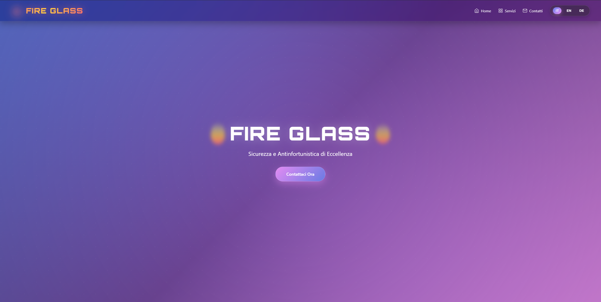
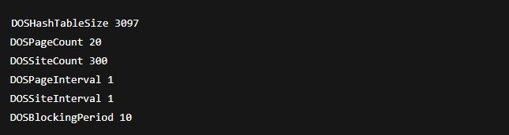
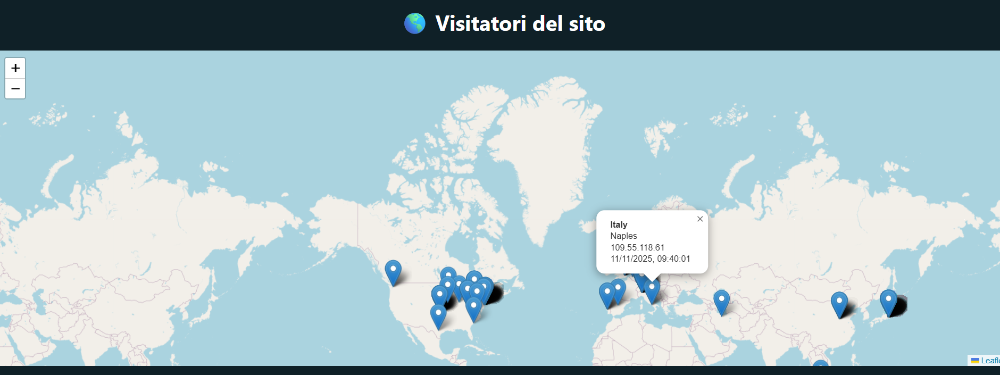
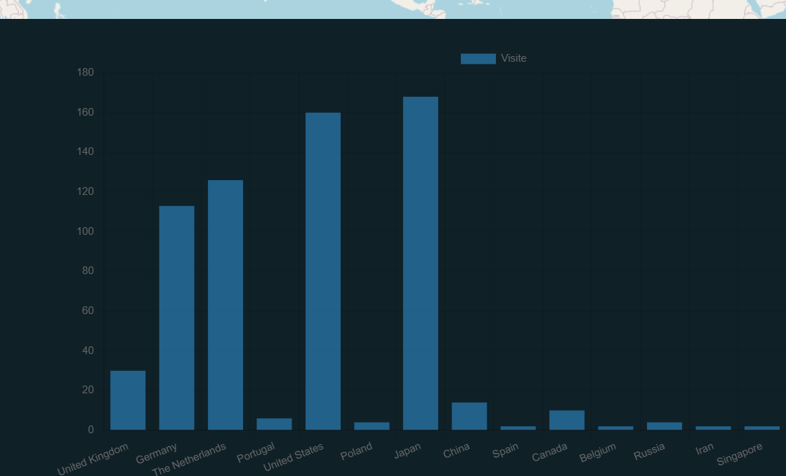

# FireGlass Hybrid Cloud Infrastructure Project

## Overview

This project documents the complete design and deployment of a **hybrid on‑premises + Azure cloud infrastructure** for the company **FireGlass**, transitioning from a fully local environment to a scalable, secure, and cloud‑integrated architecture.

The solution includes:

* On‑premises virtualization with **Proxmox VE**
* Firewall, Tunneling, IDS/IPS using **OPNsense**
* Local **Active Directory Domain Services**
* DMZ web server with HTTPS and security hardening
* Azure infrastructure with Private Web Server, Entra ID Connect, NSGs, VNETs
* Secure hybrid identity synchronization
* Management client and subnet segmentation


---

# Index

1. [Project Goals](#project-goals)
2. [On‑Premise Architecture](#on-premise-architecture)
3. [Firewall & DMZ Design](#firewall--dmz-design)
4. [Active Directory Structure](#active-directory-structure)
5. [Azure Cloud Architecture](#azure-cloud-architecture)
6. [Hybrid Identity & Entra ID Connect](#hybrid-identity--entra-id-connect)
7. [Network Security Groups (NSG)](#network-security-groups-nsg)
8. [Incident Response & Security Measures](#incident-response--security-measures)
9. [Implementation Images](#implementation-images)
10. [Team](#team)

---

# Project Goals

* Migrate FireGlass infrastructure toward a hybrid cloud approach.
* Deploy a modern, secure, scalable environment.
* Implement an **on‑prem AD** with GPOs.
* Deploy an **Entra ID Connect** server for identity synchronization.
* Create a segmented architecture (LAN, DMZ, cloud subnets).
* Implement firewalling, IDS/IPS, Tunneling, and NSG policies.

---

# On‑Premise Architecture

### **Network infrastructure**

Devices:

* Mikrotik Router (connected to the switch in trunk mode)
* Netgear Switch (VLAN 503 on the interface connected to the server, untagged)
* On-premise Server (16 core, 64 GB RAM, 1 TB Disk)
* Ras Server (to access our web server from the internet)


**_Network Design_**

### **Platform: Proxmox VE**

Network Sgmentation:

* vmbr0 (Management) = 10.10.22.0 /24
* vmbr1 (WAN) = 172.16.23.0 /24 (already set up in the switch)
* vmbr2 (LAN) = 192.168.1.0/ 24
* vmbr3 (DMZ) = 192.168.10.0 /24 

 
**_Proxmox Network Segmentation_**

### **Used to virtualize**

OPNsense Firewall 25.7

Windows Server 2022 (ADDS)

Windows Server 2022 (ADsync Service)

Ubuntu Web Server 25.10


### **Network Segmentation**

* **LAN:** Internal AD environment
* **DMZ:** Public‑facing web server
* **WAN:** External traffic / PPTP Tunnel

### **Key Features**

* VLAN segmentation
* Server isolation
* Resource allocation and snapshots
* Centralized virtualization management

---

# Firewall & DMZ Design

### **Firewall: OPNsense**

Configured with:

- IPS/IDS using curated rulesets (with Suricata)
- WAN/LAN/DMZ separation
- Geo‑IP analysis for traffic (with GeoIP)
- Port forwarding for the public web server


**_Port Forward_**

- Firewall rules


**_PPTP Rules (SSH activated just for testing purpose)_**


**_LAN Rules_**


**_DMZ Rules (cannot reach LAN)_**


### **DMZ Web Server**

* Ubuntu Server with Apache2
* Web Page



**_Web Page (index.html)_**

* HTTPS enforced (certbot + Let’s Encrypt)
* DoS protection: mod_evasive Library
```bash
sudo apt install libapache2-mod-evasive
sudo a2enmod active
sudo systemctl restart apache2
sudo nano /etc/apache2/mods-available/evasive.conf
```


**_20+ requests in a second from an IP = BLOCKED 10s_**

* Access logging with geolocation (GeoIP)




**_Geolocation page_**


---

# Active Directory Structure

### **On‑Prem AD Server**

Deployed with:

* Organizational Units:

  * Vendite
  * Acquisti
  * IT
  * ServiziLogistici
* 4 Security Groups (one per OU)
* 16 Users (4 per OU)


**_Active Directory Structure_**


### **Hardening Measures**

* Password policies
* Account lockout
* GPO baseline
### Security Hardening Steps (GPO Configuration)

#### 1. AutoRun Disabled
AutoRun has been disabled to prevent the automatic execution of programs when a USB drive is inserted.

**GPO Path:**
Computer Configuration → Administrative Templates → Windows Components → AutoPlay Policies

**Settings:**
- **Turn off AutoPlay** = Enabled (All drives)
- **Turn off Autoplay for non-volume devices** = Enabled
- **Do not execute autorun commands** = Enabled


#### 2. Administrator Account Disabled and Renamed
The default Administrator account was disabled and the real admin account was renamed to avoid easy identification.

**GPO Path:**
Computer Configuration → Windows Settings → Security Settings → Local Policies → Security Options


**Settings:**
- **Accounts: Administrator account status** → Disabled
- **Accounts: Rename administrator account** → Enabled


#### 3. Automatic Session Lock After 10 Minutes
The session locks automatically after 10 minutes of inactivity.

**GPO Path:**

User Configuration → Administrative Templates → Control Panel → Personalization → Screen saver timeout


**Settings:**
- **Timeout:** 600 seconds (10 minutes)
- **Password protect the screen saver:** Enabled

#### 4. Control Panel and Software Installation Disabled
Access to the Control Panel and the ability to install software were disabled.

**GPO Paths:**

User Configuration → Administrative Templates → Control Panel → Prohibit access to Control Panel

User Configuration → Administrative Templates → Windows Components → Windows Installer → Disable Windows Installer = Always


#### 5. PowerShell and CMD Disabled for Non-Admin Users
Command-line access was restricted for non-administrator users.

**GPO Path:**

User Configuration → Administrative Templates → System → Prevent access to command prompt = Enabled

#### 6. Task Manager Disabled
Task Manager access was blocked for standard users.

**GPO Path:**

User Configuration → Administrative Templates → System → Ctrl+Alt+Del Options → Remove Task Manager = Enabled

#### 7. IPv6 Disabled
IPv6 was disabled because it is not used in this environment.

**Path:**
Network Adapter → Properties → Uncheck: Internet Protocol Version 6 (IPv6)

#### 8. Windows Defender Enabled
Windows Defender protections were fully enabled.

**GPO Path:**

Computer Configuration → Administrative Templates → Windows Components → Microsoft Defender Antivirus


**Settings:**
- **Turn on real-time protection** = Enabled
- **Turn on behavior monitoring** = Enabled
- **Cloud-delivered protection** = Enabled
- **Scan removable drives** = Enabled
- **Check for definition updates** = Every 4 hours


---

# Azure Cloud Architecture

### **Infrastructure Includes**

* **Management Client VM**
* **Resource Group + VNET + 2 Subnets:**

  * 10.0.0.0/24 → Management
  * 10.0.1.0/24 → Private Web Server
  
 

### **Networking**

* Private addressing only
* No public exposure except management VM

---

# Hybrid Identity & Entra ID Connect

Configured features:

* Password Hash Sync
* Password Writeback
* Hybrid Users synchronization

### **Azure Access Control**

* RBAC assigned to IT‑Servizi group
* Least‑privilege roles for maintenance

---

# Network Security Groups (NSG)

## Management Client

- The Inbound Security Rules are as follows:
  - “Allow_WebServer_HTTPS”: Only resources on the same Azure network can communicate, thus allowing Client Management to receive HTTPS responses from the Web Server on port 8443.
  - “Allow_Internal”: Allows all internal traffic between resources in the VNET.
  - “Allow_RDP_Public”: Allows Remote Desktop (RDP) access to 
  Client Management only from a specific public IP address.

- The Outbound Security Rules are as follows:
  - “Allow_WebServer_HTTPS_Out”: Allows Client Management to send SSH requests to the Web Server, but only internal resources can initiate this connection.


**_Management Client NSG_**

## Private Web Server

- The Inbound Security Rules are as follows:
  - “Deny_Internet”: Blocks all TCP traffic from the Internet to any destination, thus denying direct access from the Internet.
  - “Allow_ClientMgmt_HTTPS”: Allows HTTP traffic from the VNET.
  - “Deny_RDP”: Blocks RDP connections from any source, thus preventing remote desktop access.
  - “Allow_AccessCM”: Allows SSH connections from a specific IP.
- The Outbound Security Rule is as follows:
  - “Deny_Internet_Out”: Blocks all outbound traffic to the Internet.

  
---

# Incident Response & Security Measures

### **On‑Prem**

* IDS/IPS
* HTTPS enforcement
* SSH hardening
* Firewall rules limiting traffic

### **Cloud**

* NSG micro‑segmentation
* MFA for admin access
* AD Sync monitoring
* Backup and Recovery strategy

---

# Conclusion

This project successfully delivers a secure and scalable **hybrid cloud infrastructure** for FireGlass, integrating Azure services with on‑prem identity, implementing modern security controls, and providing a foundation ready for future expansion.
