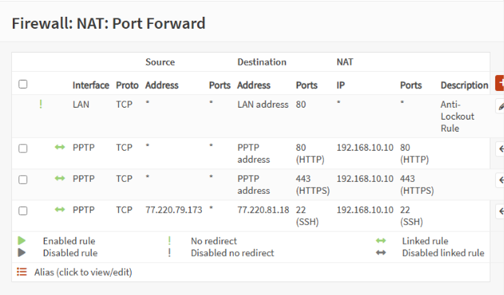
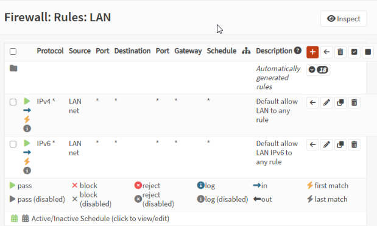
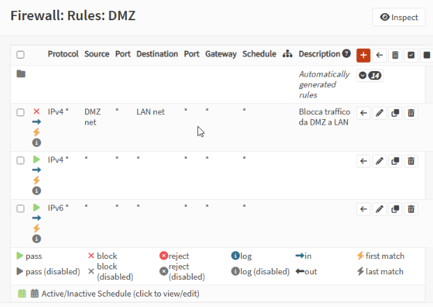
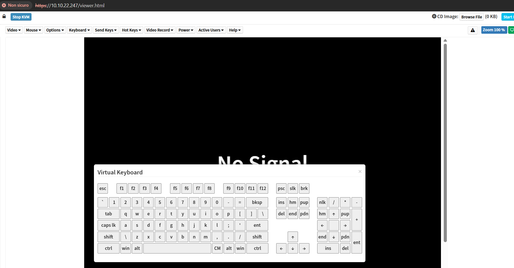

# FireGlass Hybrid Cloud Infrastructure Project

## Overview

This project documents the complete design and deployment of a **hybrid on‑premises + Azure cloud infrastructure** for the company **FireGlass**, transitioning from a fully local environment to a scalable, secure, and cloud‑integrated architecture.

The solution includes:

* On‑premises virtualization with **Proxmox VE**
* Firewall, Tunneling, IDS/IPS using **OPNsense**
* Local **Active Directory Domain Services**
* DMZ web server with HTTPS and security hardening
* Azure infrastructure with Private Web Server, Entra ID Connect, NSGs, VNETs
* Secure hybrid identity synchronization
* Management client and subnet segmentation

---

# Index

1. [Project Goals](#project-goals)
2. [On‑Premise Architecture](#on-premise-architecture)
3. [Firewall & DMZ Design](#firewall--dmz-design)
4. [Active Directory Structure](#active-directory-structure)
5. [Azure Cloud Architecture](#azure-cloud-architecture)
6. [Hybrid Identity & Entra ID Connect](#hybrid-identity--entra-id-connect)
7. [Network Security Groups (NSG)](#network-security-groups-nsg)
8. [Incident Response & Security Measures](#incident-response--security-measures)
9. [Implementation Images](#implementation-images)
10. [Team](#team)

---

# Project Goals

* Migrate FireGlass infrastructure toward a hybrid cloud approach.
* Deploy a modern, secure, scalable environment.
* Implement an **on‑prem AD** with GPOs.
* Deploy an **Entra ID Connect** server for identity synchronization.
* Create a segmented architecture (LAN, DMZ, cloud subnets).
* Implement firewalling, IDS/IPS, Tunneling, and NSG policies.

---

# On‑Premise Architecture

### **Network infrastructure**

Devices:

* Mikrotik Router (connected to the switch in trunk mode)
* Netgear Switch (VLAN 503 on the interface connected to the server, untagged)
* On-premise Server (16 core, 64 GB RAM, 1 TB Disk)
* Ras Server (to access our web server from the internet)

**_Network Design_**

### **Platform: Proxmox VE**

Network Sgmentation:

* vmbr0 (Management) = 10.10.22.0 /24
* vmbr1 (WAN) = 172.16.23.0 /24 (already set up in the switch)
* vmbr2 (LAN) = 192.168.1.0/ 24
* vmbr3 (DMZ) = 192.168.10.0 /24 

 
**_Proxmox Network Segmentation_**

### **Used to virtualize**

OPNsense Firewall 25.7

Windows Server 2022

Ubuntu Web Server 25.10

### **Network Segmentation**

* **LAN:** Internal AD environment
* **DMZ:** Public‑facing web server
* **WAN:** External traffic / PPTP Tunnel

### **Key Features**

* VLAN segmentation
* Server isolation
* Resource allocation and snapshots
* Centralized virtualization management

---

# Firewall & DMZ Design

### **Firewall: OPNsense**

Configured with:

- IPS/IDS using curated rulesets (with Suricata)
- WAN/LAN/DMZ separation
- Geo‑IP analysis for traffic (with GeoIP)
- Port forwarding for the public web server

**_Port Forward_**

- Firewall rules

**_PPTP Rules (SSH activated just for testing purpose)_**

**_LAN Rules_**

**_DMZ Rules (cannot reach LAN)_**

### **DMZ Web Server**

* Ubuntu Server with Apache2
* HTTPS enforced (certbot + Let’s Encrypt)
* DoS protection: mod_evasive
* Access logging with geolocation

---

# Active Directory Structure

### **On‑Prem AD Server**

Deployed with:

* Organizational Units:

  * Vendite
  * Acquisti
  * IT
  * ServiziLogistici
* 4 Security Groups (one per OU)
* 16 Users (4 per OU)

### **Hardening Measures**

* Password policies
* Account lockout
* GPO baseline

---

# Azure Cloud Architecture

### **Infrastructure Includes**

* **Cloud Domain Controller** (replica of on‑prem)
* **Entra ID Connect Server**
* **Management Client VM**
* **Resource Group + VNET + 3 Subnets:**

  * 10.0.0.0/24 → Management
  * 10.0.1.0/24 → Entra ID Sync
  * 10.0.2.0/24 → Cloud DC

### **Networking**

* VPN or S2S connectivity from OPNsense to Azure
* Routing for AD replication
* Private addressing only
* No public exposure except management VM

---

# Hybrid Identity & Entra ID Connect

Configured features:

* Password Hash Sync
* Password Writeback
* Hybrid Users synchronization
* Verification of replication between on‑prem and cloud DC

### **Azure Access Control**

* RBAC assigned to IT‑Servizi group
* Least‑privilege roles for maintenance

---

# Network Security Groups (NSG)

Rules implemented:

1. Communication only between AD and Entra ID sync server
2. Management Client → RDP to Entra ID server **allowed**
3. Management Client → RDP to AD **blocked**
4. Only Management Client has a public IP
5. No inbound Internet access to cloud servers
6. Segmented East‑West traffic between subnets

---

# Incident Response & Security Measures

### **On‑Prem**

* IDS/IPS
* HTTPS enforcement
* SSH hardening
* Firewall rules limiting traffic

### **Cloud**

* NSG micro‑segmentation
* MFA for admin access
* AD Sync monitoring
* Backup and Recovery strategy

---

# Implementation Images

Below are images extracted from the original project documentation.
(Ensure you upload the `/images` folder to your GitHub repo.)

### **Example:**

*(Replace image names with actual filenames from /images/word/media)*

---

# 🏁 Conclusion

This project successfully delivers a secure and scalable **hybrid cloud infrastructure** for FireGlass, integrating Azure services with on‑prem identity, implementing modern security controls, and providing a foundation ready for future expansion.
